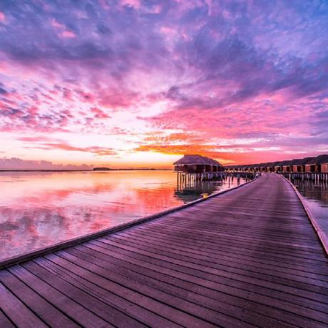
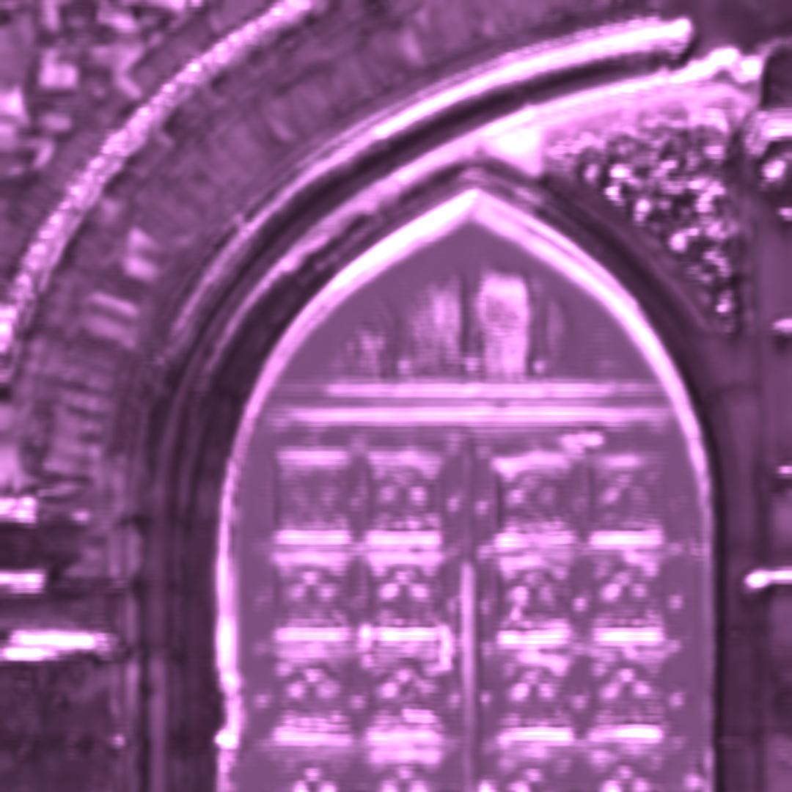
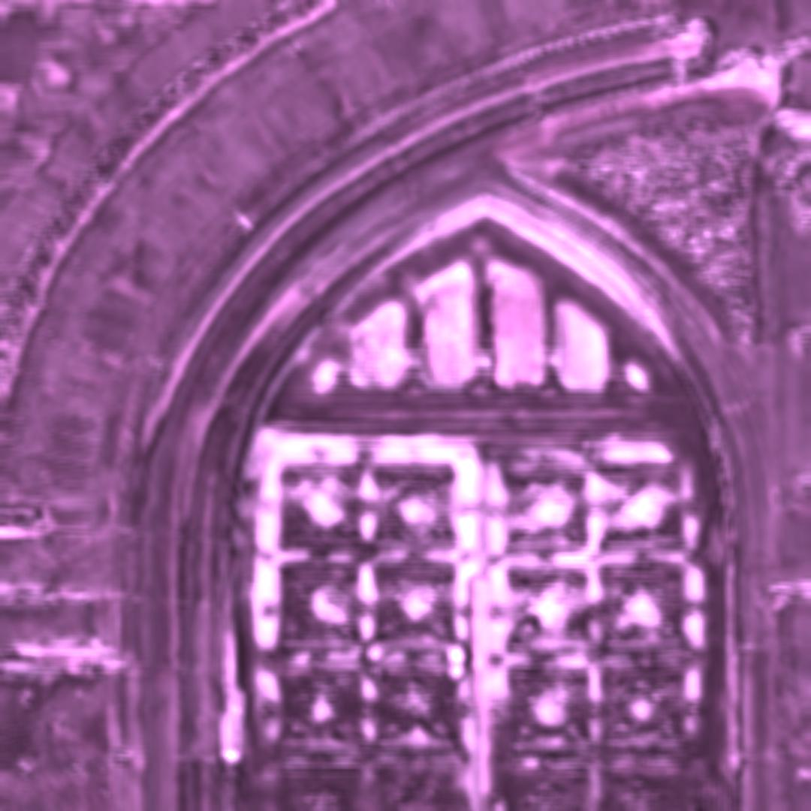
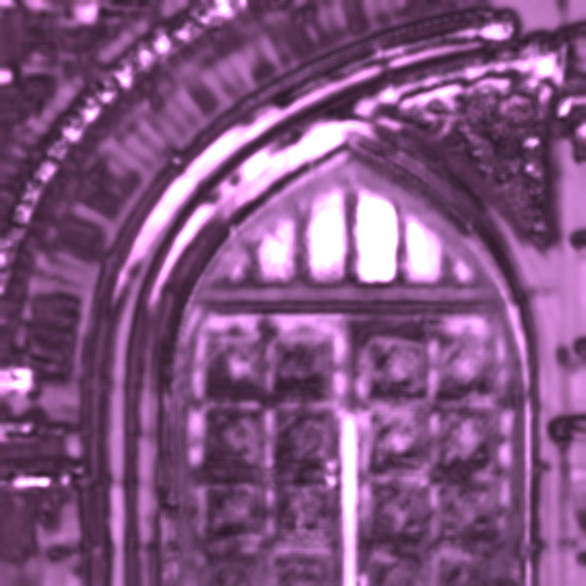

# pytorch_fast_style_transfer
Pytorch implementent of the fast style transfer paper "Perceptual Losses for Real-Time Style 
Transfer and Super-Resolution". arxiv link [1603.08155](https://arxiv.org/abs/1603.08155).

Contents:
+ [Contribution](#contribution)
+ [Intuition](#intuition)
+ [Results](#results)
+ [References](#references)

### Contribution
+ pytorch implement 
+ comparision experiments for different feature models
+ comparision experiments for different representation layer of the feature model

### Intuition
+ paper reimplement for better style transfer understanding.
+ What's the influence of the transformer net on the style transfer result?
+ Does the representation important (the vgg high dimension feature map) on the transformer model? 
What's the role of the feature model played on the transformer model?
+ How to set the layer set `J`. One certain layer is hard to choose for the perceptual loss, so the 
combination of all the multi-layers is better? If better, how better? 
+ What about different layer set `J`?
+ And should different layers have the same weight? Should they have a personal weight on the style loss?
+ What's the content, and what's the style?

### Results
|content|style|
|:-----:|:----:|
|||

The style transfer result is :

|config|result|
|:-----:|:----:|
|vgg16, 5000 iter||
|vgg19, 10000 iter||
|resnet101, 10000 iter||

### References
+ [pytorch official fast style transer example](https://github.com/pytorch/examples/tree/master/fast_neural_style)
